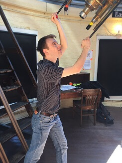

  

I am a Junior Data Scientist/Scientific Programmer at the University of Minnesota's Institute of Health Informatics. I work for Dr. Sisi Ma and Dr. Jessica Nielson on various psychiatry and neuroscience projects. The big one deals with the National Data Archive (NDA) and Federal Interagency Traumatic Brain Injury Research (FITBIR) databases, finding ways to make them more accessible. Additionally, I use various machine learning and causal inference algorithms to help them understand PTSD in patients better, so that clinicians can develop better treatment plans.

I graduated from the University of Illinois in May 2017 with degrees in physics and astronomy, along with minors in mathematics and communications. I am interested in using data science to help improve people's lives.
