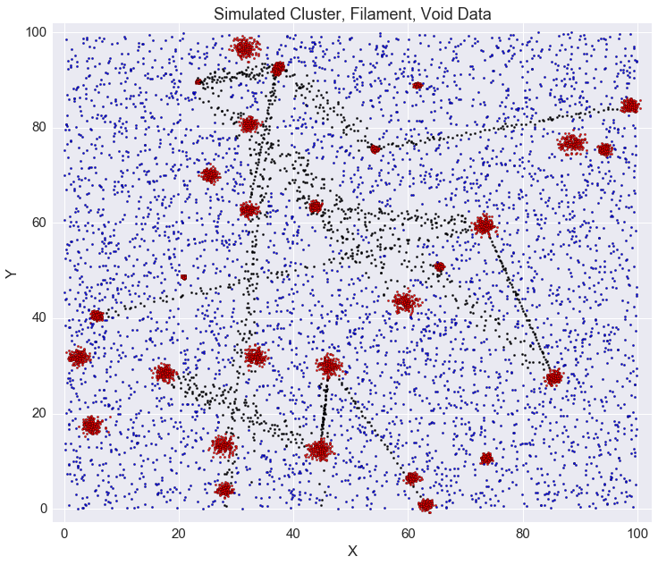

## Ongoing Projects

### Applying Machine Learning to Large-Scale Structure  
This project is being worked on under [Matias Carrasco-Kind](matias-ck.com). I have been studying how we can use machine learning to classify galaxies as being part of clusters, filaments, or voids. To begin, I create my own simulation data. First I create the clusters, then the filaments, and lastly the void or "noise" data.  
  

### Helium Reionization

### Self-Targeting Wireless Power Transmission
