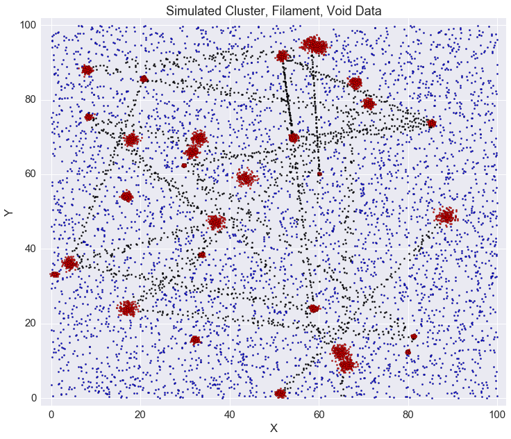
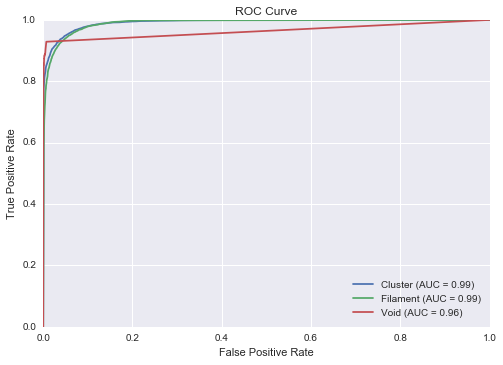
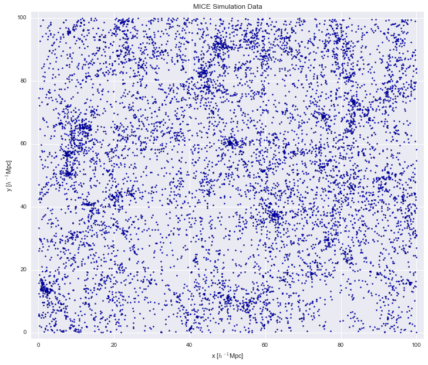
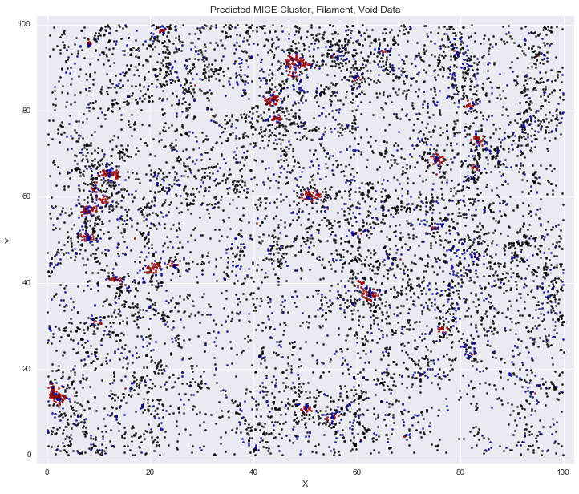

## Ongoing Projects

### Applying Machine Learning to Large-Scale Structure  
This project is being worked on under [Matias Carrasco-Kind](matias-ck.com). I have been studying how we can use machine learning to classify galaxies as being part of clusters, filaments, or voids. To begin, I create my own simulation data. First I create the clusters, then the filaments, and lastly the void or "noise" data. Clusters are in red, filaments are in black, and voids are in blue.  
  
<table class="image">
<caption align="bottom">Figure 1: Dataset that was used to train algorithm on.</caption>
<tr><td></td></tr>
</table>  
  
  
This dataset was used to test the machine learning algorithm with a similar dataset.

<table class="image">
<caption align="bottom">Figure 2: Dataset that was used to test algorithm on.</caption>
<tr><td></td></tr>
</table>  
  
  
The predictions are shown in a ROC curve.  
  
<table class="image">
<caption align="bottom">Figure 3: ROC curve for data.</caption>
<tr><td></td></tr>
</table>  
  
  
Next, I obtain a slice of data from the MICE catalog. I use the data in Figure 1 as training data and run my algorithm on the MICE data.  
<table class="image">
<caption align="bottom">Figure 4: Slice of the MICE data used as testing data.</caption>
<tr><td></td></tr>
</table>  
  

Running my algorithm on the MICE data produced some predictions that weren't quite correct.
  
<table class="image">
<caption align="bottom">Figure 5: Predicted classifications for galaxies in the MICE data.</caption>
<tr><td></td></tr>
</table>
  
  
Currently, I am testing a new method of generating my simulation data that isolates the clusters and filaments better. AFter that I will test results from the YT halo finder.  

### Helium Reionization  
  
I am working on this project under Professor Gil Holder. Quasars emitted ultraviolet radiation that ionized helium in the gas surrounding the quasar, which created bubbles of ionized helium. These bubbles have an optical depth that is dependent on the ionized helium. After deriving an analytical calculation for the optical depth for one bubble, I calculated the optical depth for a box of bubbles using parameters from a simulation paper. Currently, I am working on constructing the angular power spectrum and graphing it using Python. The goal of this project is to determine whether or not the South Pole Telescope (SPT) can detect the signature from the helium bubbles in the CMB and what that signature would look like.  

### Self-Targeting Wireless Power Transmission  
  
I am working on this project with Professor Alfred Hubler. We believe that waves can be manipulated to transmit their energy from a sender to receiver in such a way to prevent an observer from seeing any transmission in the far-field. I have used MATLAB and Python to model the power transmitted at different frequencies, resistances, and distances. The wireless power transmitted can also be safely sent through humans by using non-sinusoidal waves. Right now we are running tests using different frequencies, energies, and distances to verify our predictions. We transmit these waves through plastic wrap, egg whites, and a saline solution, and measure the change in temperature of the samples. Our experimental setup included an oscilloscope, power supply, digital radio which was created by soldering a phase-locked loop and a voltage-controlled oscillator onto an evaluation board, and taking measurements using a thermal camera. This work has resulted in [one paper](http://thomaskirsh.com/Publications.html) and a [patent application](http://thomaskirsh.com/CV.html).
